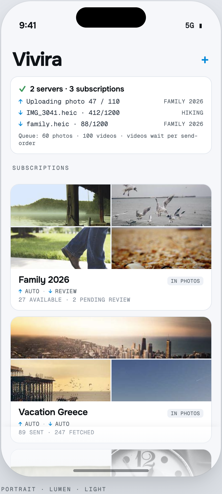
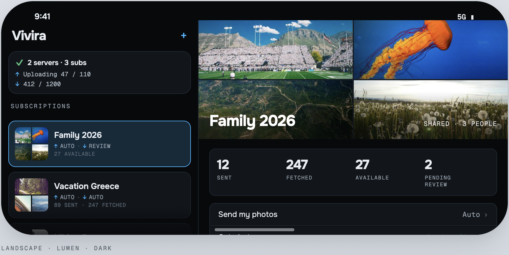

# Vivira

A subscriber for self-hosted [Immich](https://github.com/immich-app/immich) shared albums on iPhone. Subscribe one or more iPhones to one or more Immich shared albums; Vivira keeps the photos reflected on the device. Light and dark theming, five user-selectable accent palettes (Lumen default), full accessibility scope.

  

  

## Design

See [`docs/superpowers/specs/`](docs/superpowers/specs/) for the UX flow design, UX paradigms, and design system spec.
